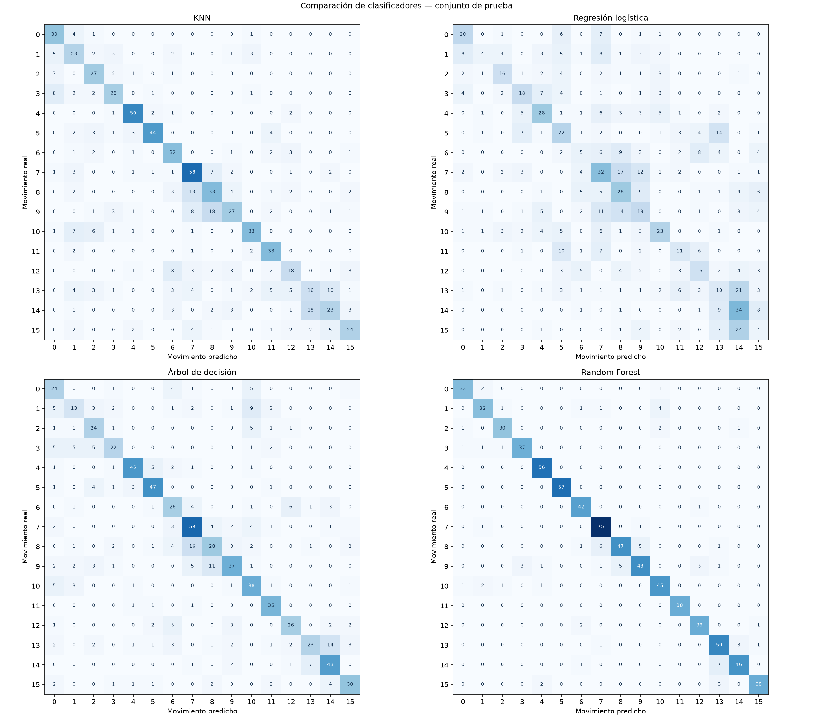

# Comparación de modelos para REHAB

## Descripción del problema

El problema es de clasificación multiclase: queremos identificar uno de los 16 movimientos de rehabilitación. La variable objetivo es `movimiento`, con valores de 0 a 15. Las entradas son 18 números que resumen las señales del sensor 2. Por eso podemos usar clasificadores para datos numéricos, como KNN, regresión logística y árboles.

## Preparación de datos

Se lee `output/dataset_ml.csv`, preparado en la actividad anterior (ml-sin-framework). Cada muestra tiene seis canales (`f1` a `f5` y `pitch3`), resumidos mediante media absoluta, desviación estándar poblacional y rango. En cada fila están esas 18 características y la etiqueta. Estos resúmenes describen cuánto varía la señal, aunque pierden su orden temporal.

Se conservaron las 16 clases usando el sensor 2, ya que existe un archivo dañado del sensor 1. De 4,616 muestras se eliminaron 68 señales completamente nulas y 658 duplicados exactos; no había valores no finitos. Quedaron 3,890 muestras. La limpieza se hizo antes de dividirlas para evitar que una misma señal apareciera en ambos conjuntos. Si el CSV falta, el script lo vuelve a generar con las funciones de `main.py`, sin entrenar el KNN manual.

## Modelos seleccionados

| Modelo | Configuración | Por qué se eligió |
|---|---|---|
| KNN | 5 vecinos, distancia euclidiana y voto uniforme | Permite comparar con la técnica manual anterior |
| Regresión logística | C=1, lbfgs, máximo 2,000 iteraciones | Sirve como comparación con un clasificador lineal |
| Árbol de decisión | Profundidad máxima 10, semilla 42 | Aprende reglas y relaciones no lineales; se limita su profundidad |
| Random Forest | 100 árboles, semilla 42, profundidad sin límite | Combina varios árboles para no depender de uno solo |

Los demás parámetros conservan sus valores predeterminados. No se realizó búsqueda de hiperparámetros ni ajustes según la prueba.

## Entrenamiento

Se reutiliza `dividir_datos` de la primera actividad: mezcla cada clase con semilla 42 y toma aproximadamente 80 % para entrenamiento y 20 % para prueba. Se conservan exactamente las mismas 3,105 muestras de entrenamiento y 785 de prueba para los cuatro modelos.

KNN y regresión logística usan un `Pipeline` con `StandardScaler`, ajustado exclusivamente con entrenamiento. Así la escala de una característica no domina el modelo y los datos de prueba no intervienen en la normalización. Los árboles reciben las características sin estandarizar. La regresión logística convergió en 133 iteraciones; el programa detiene el entrenamiento si aparece una advertencia de falta de convergencia.

`train_models.py` guarda los modelos, el orden de las características, la prueba y la versión de scikit-learn en `output/comparacion_modelos/modelos.joblib`. También comprueba que las predicciones no cambian después de guardar y cargar. `evaluate_models.py` carga ese archivo y evalúa sin entrenar de nuevo.

## Comparación

Resultados obtenidos con los datos incluidos. Las métricas se muestran entre 0 y 1:

| Modelo | Accuracy | Precisión macro | Recall macro | F1 macro |
|---|---:|---:|---:|---:|
| Random Forest | 0.9070 | 0.9095 | 0.9078 | 0.9074 |
| Árbol de decisión | 0.6624 | 0.6613 | 0.6591 | 0.6512 |
| KNN | 0.6331 | 0.6310 | 0.6411 | 0.6273 |
| Regresión logística | 0.3682 | 0.3761 | 0.3618 | 0.3577 |

Accuracy indica la proporción total de aciertos. Precisión mide cuántas predicciones de una clase son correctas; recall mide cuántos ejemplos reales de esa clase se reconocen. F1 combina precisión y recall. El promedio macro calcula la métrica por clase y luego promedia las 16 clases con el mismo peso. Se usa cero cuando una métrica no se puede calcular por falta de predicciones.



Las filas son los movimientos reales y las columnas los predichos. Cada matriz suma 785 muestras; la diagonal contiene los aciertos. Las cuatro figuras comparten la misma escala de color.

El KNN de scikit-learn obtuvo 497 aciertos, frente a 532 del manual. Se comprobó que las 57 diferencias de predicción se explican por la regla de votación: al aplicar el desempate manual a los vecinos de scikit-learn se recuperan todas las predicciones anteriores. La implementación manual desempata por suma de distancias antes de usar la etiqueta; el voto uniforme de la biblioteca elige la etiqueta menor en un empate.

## Decisión final

Se seleccionó Random Forest porque obtuvo el mayor F1 macro (0.9074) y también la mayor accuracy (90.70 %): acertó 712 de 785 muestras. Superó al árbol individual por 25.63 puntos porcentuales de F1 macro. En esta comparación, combinar varios árboles permitió reconocer mejor los movimientos que usar un solo árbol, vecinos cercanos o un clasificador lineal.

Su ventaja es que puede representar relaciones no lineales entre las características sin normalizarlas. Como desventajas, ocupa más espacio y es más difícil explicar cada predicción que con un árbol sencillo. Todavía cometió 73 errores; por ejemplo, confundió 7 muestras del movimiento 14 con el 13.

El criterio elegido antes de evaluar fue mayor F1 macro, con desempate por accuracy y después por nombre. Random Forest es el mejor de esta comparación; como se eligió usando esta prueba, su resultado no es una evaluación independiente posterior. Además, la separación es por muestras y no por participantes, porque los archivos usados no incluyen sus identificadores. No se puede asegurar el mismo desempeño en personas nuevas.

## Cómo ejecutar el proyecto

Desde la carpeta del proyecto, correr:

```bash
python -m pip install -r requirements.txt
python train_models.py
python evaluate_models.py
```

Si el sistema utiliza `python3`, sustituir `python` por `python3`. Las rutas dependen de la ubicación de los scripts, así que también se pueden ejecutar mediante su ruta absoluta desde otra carpeta.

Versiones verificadas: NumPy 2.5.3, scikit-learn 1.9.1, Matplotlib 3.11.2 y Joblib 1.6.0. Si cambia scikit-learn, hay que volver a entrenar. Si se intenta evaluar sin modelos guardados, aparece el comando para entrenarlos.

Los resultados se guardan en `output/comparacion_modelos/`: `resultados.csv` contiene la tabla completa; `predicciones.csv`, las etiquetas reales y las cuatro predicciones por muestra; `matrices_confusion.png`, las matrices; y `resumen.json`, el ganador y sus métricas. Cada ejecución sobrescribe las salidas de esta actividad.

Se verificaron la generación del CSV cuando falta, la separación sin características idénticas entre conjuntos, las métricas con ejemplos pequeños, la normalización solo con entrenamiento, la conservación de predicciones al guardar y la ejecución desde otra carpeta. Dos entrenamientos dieron las mismas predicciones y tablas. El código manual y los datos originales se conservaron.
